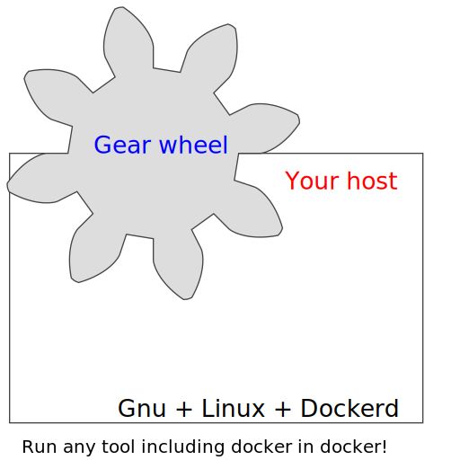

# Gearwheel 

Gearwheel is a tool set used mostly for building docker images.
But it is more, than just a builder.
- It makes use of 'dockerised' tool's (which runs inside docker)
  as simple as using local installed tools.
- And it makes run docker containers inside dind (docker in docker)
  as simple as running them just in host's docker.


Yes it is simple, look inside the example file `./build-example-project.sh`
You can write your OPS script like there is no docker around, but it is.

## What Gearwheel is?

Gearwheel is currently a wrapper written in shell (sh).

## What Gearwheel does? And why?

* Transparent substitution of commands
  like `docker` `docker-compose` `mvn` and such (potentially any program)
  with their dockerised versions;
  * Useful if the tool is ugly and dirty
    and you just don't want to install it on the host;
  * Useful when incompatible tools rejects to run on the same host;
  * Useful to get new and even edge versions of tools
    on industrial distributives.
* Run tools using 'services' like dind
  and use them seamless with dockerised tools;
  * Same as above including build in modern dind while host's dockerd is 1.12+;
  * Per build service isolation.
* Export docker images and docker volumes standard way.
  * After build finishes, the service will automatic export its artifacts.

You can use CI/CD machine with only:
- Coreutils;
- Docker v1.12+;
- Gearwheel.

No other tools needed,
you can even use coreutils from busybox:latest inside your build script.

## How to use Gearwheel?

### Quick start

You can check it works
by just run example build. E.g.: Just run `./Jenkins_example-project`

*No, you don't need Jenkins*, that's just the name of start script.
`./Jenkins_example-project` 'emulates' build server's work:
- sets some environment;
- changes working directory;
- starts the build: `./build-example-project.sh`.

Build script `./build-example-project.sh` is written using shell (sh)
and contains several example build tasks. After test build finishes,
you will get example docker artifacts in `./workdir/docker-target/`.

### Slow start

* EXAMPLE #1 build docker image from Dockerfile.
Replace content between two horizontal lines in `./build-example-project.sh`:
```bash
# -----------------------------------------------------------------------------

pushd /directory/with/Dockerfile
docker build -t targettag:latest .
popd

# -----------------------------------------------------------------------------
```

* EXAMPLE #2 build docker project with docker-compose.yaml.
Replace content between two horizontal lines in `./build-example-project.sh`:
```bash
# -----------------------------------------------------------------------------

pushd /directory/with/docker-compose.yaml
docker-compose build
docker-compose up -d
docker-compose down
popd

# -----------------------------------------------------------------------------
```

### Full instructions

- First you need a project with complete build script
  like: unzip -> change directory -> perform build steps;

- Create or select 'wheels' (profiles) useful for your build job
  and set it in `GEARWHEEL_WHEELS` variable;

  - `GEARWHEEL_WHEELS` variable may contain one or more
    space separated profile names from local/etc/gearwheel.d/*.
    If there are duplicated tools inside them,
    first wheel (profile) will be used first;

  - If you want to create new wheel (profile),
    use `./local/etc/gearwheel.d/multigear.sh`.
    It will create new wheel from the `DEFAULT` one.

- Name your build job and set the name in `GEARWHEEL_TASKID` variable;

  - You don't have to do it,
    `GEARWHEEL_TASKID` will be auto set to some ugly string if not set.

- Using `./build-example-project.sh` add your build script in `build-*.sh`.
  Your build jobs should be between two horizontal lines;

  - Actually, you can run build anywhere,
    but for first time better place your tasks between the lines.

- Make sure the services set in `build-*.sh` script are okay.

  - Currently you are to use Ugly-style service start technique,
    but all examples will be always accessible in `./build-example-project.sh`;

  - The service is controlled with `wheelctl` function:
    `wheelctl [ start | stop | restart | status ] serviceName`;

  - If you stop the service manually, then all its state will be lost.
    Be sure you extract all the data before stop service;

  - All services stops automatically on script's exit.
    In such case the data will be extracted to certain directories
    (watch info messages).

- Run `build-*.sh` with `GEARWHEEL_WHEELS` and `GEARWHEEL_TASKID` variables set;

  - If `GEARWHEEL_WHEELS` is not set, then `DEFAULT` wheel is used;

  - If `GEARWHEEL_TASKID` is not set, them `GEARWHEEL_TASKID` is generated;

  - You can use `./Jenkins_example-project`
    to prepare a starter script for your project.
    It sets variables and runs `build-*.sh`;

  - If you running script as part of CI/CD pipeline,
    make sure env variables are set right.

* You can use Gearwheel on desktop:
  - use something like `./Jenkins_example-project` script as starter script;
* You can use it on a build server:
  - use `./Jenkins_example-project`
    to find out what variables to set
    for executing `build-*.sh` from build server's pipeline;
* You can use it other way.

## To do

* Add and test more tools;
* Optimize code to run in Apline linux and jenkins:alpine;
* Code clean:
  * VERBOSE_LEVELs;
  * More useful diagnostic messages;
  * Maybe slow parts rewrite;
* Test in various sutuations;
* Add service busybox;
* Readme add FAQ;
* Fix using without dind.
